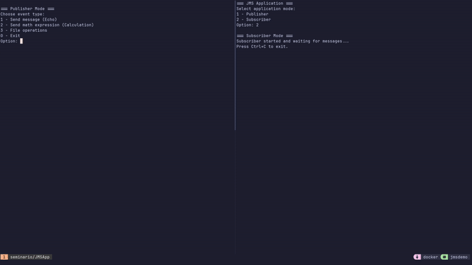

# JMS Application

A Java Messaging Service (JMS) application that demonstrates publisher-subscriber communication model using Apache ActiveMQ Artemis.

## Table of Contents
- [Overview](#overview)
- [Prerequisites](#prerequisites)
- [Running Locally](#running-locally)
- [Building the Project](#building-the-project)
- [Docker Deployment (Single Machine)](#docker-deployment-single-machine)
- [Docker Deployment (Multiple Machines)](#docker-deployment-multiple-machines)
- [Usage Guide](#usage-guide)
- [Project Structure](#project-structure)

## Overview

This application demonstrates a message-based communication system using JMS (Java Messaging Service) with Apache ActiveMQ Artemis as the message broker. The application supports both publisher and subscriber roles, allowing for asynchronous communication and file processing.



## Prerequisites

- Java 11 or higher (Current project uses Java 17.0.14)
- Apache Maven 3.6+ (Current project uses Maven 3.9.9)
- Docker 20.10+ (Current project uses Docker 28.0.4) and Docker Compose
- Apache ActiveMQ Artemis (if running locally without Docker)

## Running Locally

### Step 1: Set Up ActiveMQ Artemis

Start ActiveMQ Artemis using one of these methods:

**Using Docker:**
```bash
docker run -p 61616:61616 -p 8161:8161 apache/activemq-artemis:latest-alpine
```

**Using Local Installation:**
1. Download and install [Apache ActiveMQ Artemis](https://activemq.apache.org/components/artemis/download/)
2. Navigate to the installation directory
3. Start the broker:
```bash
./bin/artemis run
```

Default login credentials:
- Username: `artemis`
- Password: `artemis`

### Step 2: Run the Application

Use the provided script:
```bash
chmod +x run.sh  # Make script executable if needed
./run.sh
```

Or run with Maven:
```bash
mvn exec:java
```

When prompted, select your desired mode:
- Option 1: Publisher
- Option 2: Subscriber

## Building the Project

To build the project from source:

```bash
# Clone the repository
git clone git@github.com:joevtap/distributed-systems-jms-demo.git jmsapp
cd jmsapp

# Build with Maven
mvn clean package

# The built JAR will be available at target/JMSApp-1.0-SNAPSHOT.jar
```

Run the built JAR:
```bash
java -jar target/JMSApp-1.0-SNAPSHOT.jar
```

## Docker Deployment (Single Machine)

### Using Docker Compose

The project includes a `compose.yaml` file for easy deployment:

```bash
# Start all services
docker compose up -d

# View logs
docker compose logs -f

# Stop all services
docker compose down
```

This will start:
- Apache ActiveMQ Artemis broker (using latest-alpine image)
- JMS application containers (publisher and subscriber)

### Accessing the Containers

Connect to the publisher:
```bash
docker exec -it jms-publisher bash
java -jar JMSApp.jar
```

Connect to the subscriber:
```bash
docker exec -it jms-subscriber bash
java -jar JMSApp.jar
```

## Docker Deployment (Multiple Machines)

You can distribute the application across up to 3 machines using the provided `compose.yaml` file. Simply run specific services on each machine:

### Machine 1: ActiveMQ Artemis Server

1. Copy the project files to this machine
2. Run only the ActiveMQ Artemis service:

```bash
docker compose up -d activemq
```

3. Get the machine's IP address:
```bash
ip addr show
```
Note down the IP address (e.g., 192.168.1.10)

### Machine 2: Publisher

1. Copy the project files to this machine
2. Edit the `compose.yaml` file to update the broker URL:

```yaml
publisher:
  # ...existing code...
  environment:
    ACTIVEMQ_BROKER_URL: tcp://192.168.1.10:61616  # IP from Machine 1
    # ...existing code...
```

3. Run only the publisher service:
```bash
docker compose up -d publisher
```

### Machine 3: Subscriber

1. Copy the project files to this machine
2. Edit the `compose.yaml` file to update the broker URL:

```yaml
subscriber:
  # ...existing code...
  environment:
    ACTIVEMQ_BROKER_URL: tcp://192.168.1.10:61616  # IP from Machine 1
    # ...existing code...
```

3. Run only the subscriber service:
```bash
docker compose up -d subscriber
```

### Network Configuration

Ensure all machines can communicate with each other and that the following ports are open:
- 61616: JMS broker port
- 8161: ActiveMQ web console port

## Usage Guide

### Publisher Mode

When running in publisher mode:
1. You can send text messages to subscribers
2. You can send file contents as messages
3. You can send math expressions to be evaluated by subscribers using the GraalVM JavaScript engine (v22.3.1)

### Subscriber Mode

When running in subscriber mode:
1. You will receive messages from publishers
2. Math expressions will be automatically evaluated
3. You can save received file contents to disk

## Project Structure

- `src/main/java/com/joevtap/jmsapp/`
  - `JMSApplication.java`: Main application entry point
  - `Config.java`: Configuration settings
  - `Publisher.java`: Publisher implementation
  - `Subscriber.java`: Subscriber implementation
  - `FileOperations.java`: File handling utilities
  - `MathProcessor.java`: Mathematical expression processor (using GraalVM)

- `files/`: Directory for file storage
- `run.sh`: Convenience script for running the application
- `compose.yaml`: Docker Compose configuration
- `Dockerfile`: Docker image definition

---

Developed by [@joevtap](https://github.com/joevtap) as part of a Distributed Systems course seminar at UNIFEI.
Last updated: April 10, 2025
